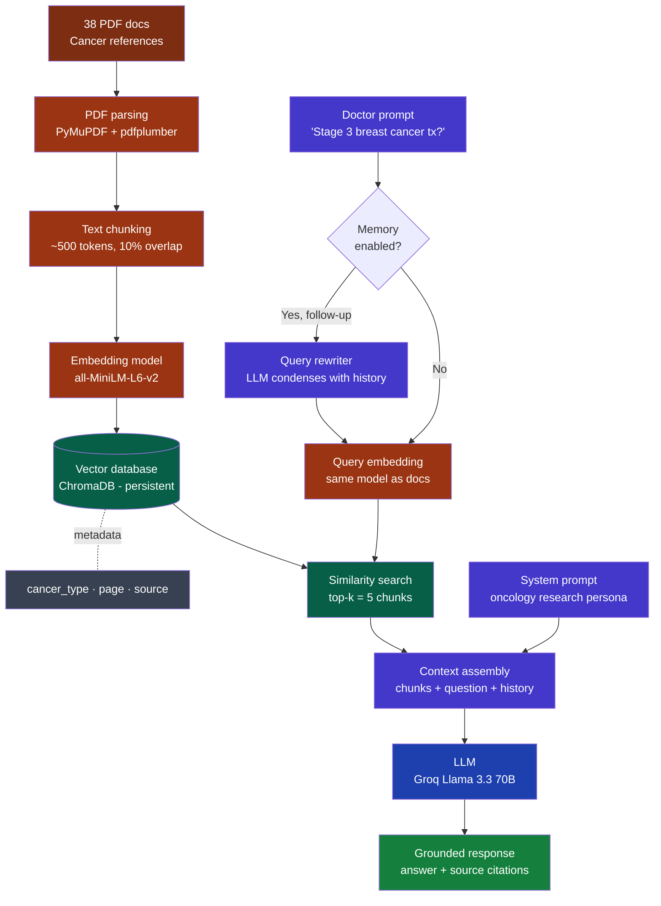

# 🩺 Cancer Research Assistant

A multi-turn Retrieval-Augmented Generation (RAG) chatbot for clinical research over a corpus of 38 cancer-specific reference documents. Built to help oncologists ask natural-language questions and receive grounded, source-cited answers.

## ✨ Features

- **Grounded Q&A** — Every clinical claim cited with source PDF and page number
- **Multi-turn memory** — Understands follow-ups like *"what about stage 4?"* via LLM-based query rewriting
- **Cancer-type filtering** — Restrict retrieval to a specific cancer's documents for precision
- **Streaming responses** — Real-time token-by-token answer generation
- **Mobile-friendly UI** — Responsive Streamlit interface with dark theme
- **100% open-source stack** — No proprietary APIs in retrieval; clinical data stays local

## 🏗️ Architecture


## 🛠️ Tech Stack

| Layer        | Technology                                        |
|--------------|---------------------------------------------------|
| PDF parsing  | PyMuPDF + pdfplumber                              |
| Embeddings   | sentence-transformers (`all-MiniLM-L6-v2`)        |
| Vector DB    | ChromaDB (persistent, local)                      |
| LLM          | Groq Llama 3.3 70B (free tier)                    |
| Memory       | Query rewriting + sliding-window history          |
| UI           | Streamlit                                         |

## 🚀 Setup

### Prerequisites
- Python 3.10 or higher
- A free Groq API key from [console.groq.com](https://console.groq.com)

### Installation

```bash
# Clone the repo
git clone https://github.com/protoydebroy/Cancer-Research-Assistant.git
cd Cancer-Research-Assistant

# Create virtual environment
python -m venv venv
source venv/bin/activate          # On Windows: venv\Scripts\activate

# Install dependencies
pip install -r requirements.txt

# Add your API key to .env file
echo "GROQ_API_KEY=gsk_yourActualKeyHere" > .env
```

### Build the knowledge base

Place your cancer PDFs in `cancer_pdfs/`, then run the pipeline:

```bash
python step1_ingest.py        # Parse PDFs into chunks
python step2_embed.py         # Generate embeddings
python step3_vectordb.py      # Load into ChromaDB
```

### Launch the app

```bash
streamlit run step6_app.py
```

Open `http://localhost:8501` in your browser.

## 📁 Project Structure

```text
🩺 Cancer-Research-Assistant/
│
├── 📥 step1_ingest.py         → Parse PDFs into ~500-token chunks
├── 🧮 step2_embed.py          → Generate embeddings locally (sentence-transformers)
├── 🗄️  step3_vectordb.py      → Index chunks into ChromaDB
├── 🔍 step4_retrieve.py       → Retrieval engine (importable module)
├── 💬 step5_chat.py           → Terminal chatbot (CLI mode)
├── 🌐 step6_app.py            → Streamlit web UI ⭐ MAIN APP
│
├── 📋 requirements.txt        → Python dependencies
├── 🔐 .env                    → API keys (gitignored)
├── 📁 cancer_pdfs/            → Source clinical reference documents
└── 📁 data/                   → Generated artifacts (gitignored)
    ├── chunks.jsonl           → Chunked text
    ├── embeddings.npz         → Vector embeddings
    └── chroma_db/             → ChromaDB persistent store
```
## 🧠 How memory works

When a doctor asks *"what about stage 4?"* after discussing breast cancer treatment, naive RAG fails because *"what about stage 4?"* embedded alone yields irrelevant matches.

This app uses **two-stage memory**:

1. **Query rewriting** — Before retrieval, the LLM rewrites the follow-up using chat history → *"What is the treatment for stage 4 breast cancer?"*
2. **Sliding-window history** — Last 4 exchanges passed to the LLM at generation time so the response stays conversational.

## ⚠️ Disclaimer

This is a **research aid**, not clinical decision support. Always verify against current guidelines and patient-specific factors.

---

Built by [@protoydebroy](https://github.com/protoydebroy)